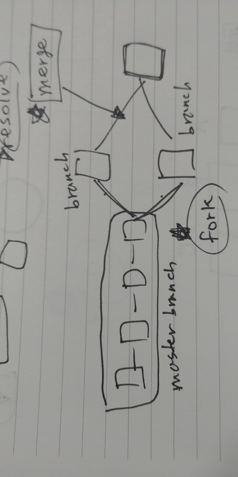

# 버전 컨트롤

## conflict
두개의 양립할 수 없는 수정된 코드가 하나의 코드에 커밋될때 일어나는 현상
## resolve

## merge

## fork
ex) git - 분산형 - 내가 고친 코드를 상대방도 볼 수 있다.(컴퓨터 마다 모든 파일을 저장함)
양립할 수 없는 두가지 버전을 커밋하고 싶을때, 사용한다.

### brench
두개이 상의 양립할 수 없는 코드

### master brench (main line)
브랜치로 나눠지기 이전의 코드

#### push
내가 만든 코드라면, 있는게 정상인 권리
#### pull
push 권한이 없는 외부 접근자가 가져가는 것을 요청 해주는 것 == pull request

## diff 보기

## revision (개정 == at this point)
git 에서는 겹치지 않는 해시 코드(16진수)로 저장됨